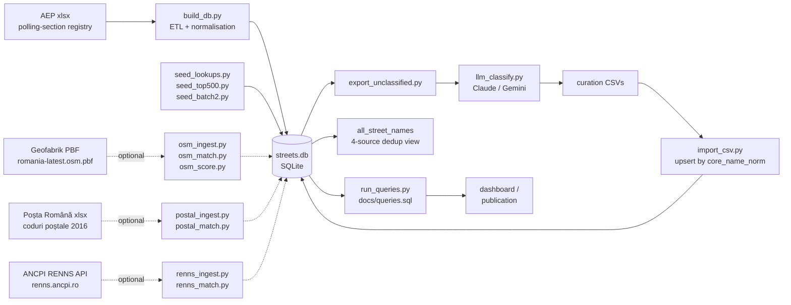
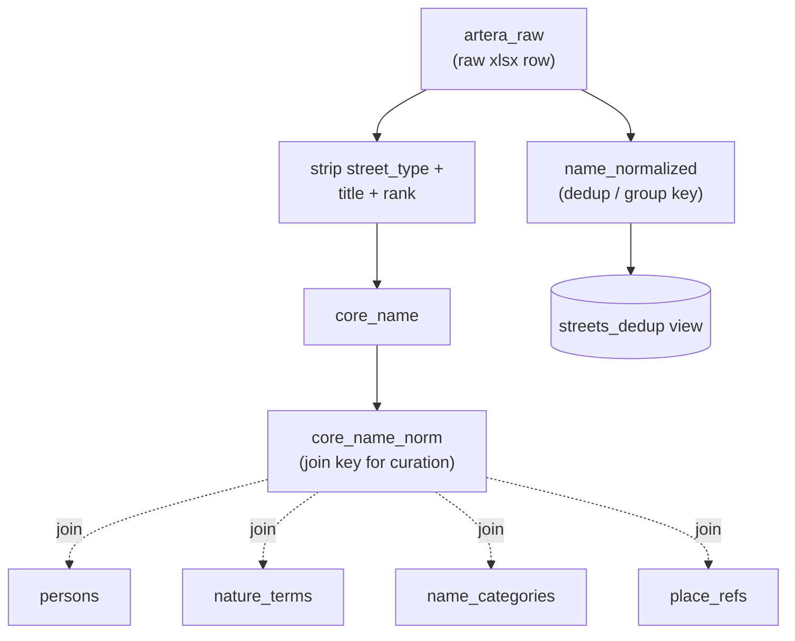
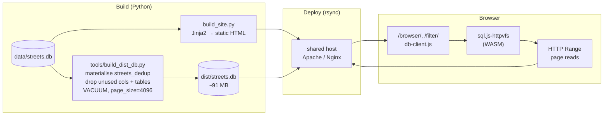
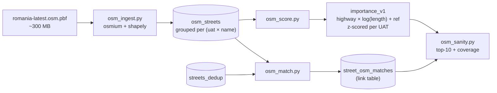
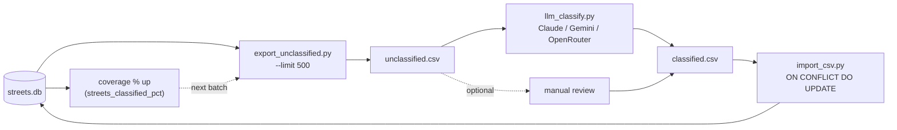

# Statistici Nume Străzi România

[strazi.gov2.ro](https://strazi.gov2.ro/)

Analysis of Romanian street names from the Permanent Electoral Authority's
polling-section registry (~141,000 rows, 41 județe + Bucharest sectors).

The output is a SQLite database with a query catalog, eventually feeding a
Romanian-language interactive publication.

---

## Preview


---

## What it does

- Ingests the registry xlsx into a normalised SQLite schema
- Deduplicates streets that span multiple polling sections
- Extracts street type, rank prefix, core name, and saint/numeric/date flags
- Classifies street names against four curated lookup tables:
  **persons**, **nature_terms**, **name_categories**, **place_refs**
- Enriches streets with OSM geometry, road class, and an importance score
  derived from highway hierarchy and length (per-UAT z-scored)
- Cross-references three more independent sources — postal codes, and
  ANCPI's RENNS cadastral registry — purely for name corroboration and gap-
  filling (no geometry), then merges all four sources into one deduplicated
  master list (`all_street_names`)
- Provides a named SQL query catalog covering overview, people, themes,
  regional maps, renaming history, curiosities, and cross-source coverage gaps

Current coverage: **64.0% classified** (107,957 deduped streets across 1,207 UATs, 42 județe).

---

## Pipeline

End-to-end flow from raw registry to query catalog. OSM, postal, and RENNS
enrichment are optional parallel branches — each contributes name
corroboration independently, then all four sources merge into one
deduplicated master list.



### Normalisation and join keys

`build_db.py` extracts two distinct normalisation keys from each raw street.
Mixing them is the most common source of wrong results.



Never count on `streets` directly — section-rows duplicate streets that span
multiple polling sections. Always use the `streets_dedup` view.

---

## Requirements

Python 3.11+. Core dependencies:

```bash
# ETL + LLM classifier
pip install openpyxl anthropic

# OSM enrichment (optional — only needed to run tools/osm_ingest.py)
pip install osmium shapely
```

A virtual environment is recommended:

```bash
python3 -m venv .venv && source .venv/bin/activate
pip install openpyxl anthropic
```

---

## Data source

The source file is the Romanian Electoral Authority's polling-section registry
("Registrul Secțiilor de Vot"). Download the latest xlsx from
[roaep.ro](https://www.roaep.ro) and place it in `data/reference/`.

The file is not committed to this repo (large xlsx, ~10 MB).

---

## Setup and build

```bash
# 1. Build the database from the xlsx
python3 build_db.py

# 2. Apply hand-curated starter seed
python3 seed_lookups.py

# 3. Apply pre-classified batches (ships with the repo)
python3 tools/seed_top500.py
python3 tools/seed_batch2.py

# 4. Run the full query catalog
python3 run_queries.py
```

For fast iteration during development, limit the number of rows ingested:

```bash
python3 build_db.py --limit 5000
```

---

## Web frontend

The site is rendered as static HTML by `build_site.py` (landing pages, ~3k detail
pages, the Browser explorer at `/browser/`, the advanced filter at `/filter/`).
The two filter pages run live SQL queries client-side via
[sql.js-httpvfs](https://github.com/phiresky/sql.js-httpvfs): the shipped
SQLite file is fetched over HTTP Range requests, so only the pages a query
touches are downloaded.



No backend is required at runtime — `filter_server.py` exists for local Python
testing only. Apache/Nginx serve `Accept-Ranges: bytes` natively.

```bash
# Build the slim production DB (materialises streets_dedup + streets_all_sources +
# all_street_names as real tables with only client-needed columns, drops source
# tables, VACUUMs). Run after each build_db.py rebuild. ~163 MB → ~91 MB (bigger
# than the pre-RENNS ~13.5 MB since the two consolidation tables now carry all
# 4 sources' worth of rows).
python3 tools/build_dist_db.py

# Render the static site (landing + detail pages)
python3 build_site.py --detail

# Local preview at http://localhost:9000/
python3 build_site.py --serve --port 9000
```

Deploy is a single command:

```bash
rsync -a --delete dist/ user@host:public_html/
```

The `dist/` tree is self-contained: HTML pages, the slim `streets.db`,
portrait JPGs, and the vendored sql.js-httpvfs runtime under `dist/_assets/`.

### Subdirectory deployment

To host under a subpath like `https://example.com/nume-strazi/` instead of the
document root, pass `--base` and `--site-url` to the build. `--base` is baked
into every link, portrait `src`, and JS path at build time — it must match the
actual deployment path exactly, and must be passed on every rebuild.

```bash
python3 build_site.py --variant all --detail \
  --base /nume-strazi \
  --site-url https://example.com
```

`--variant all` is required to rebuild `metodologie.html` alongside `index.html`;
omitting it leaves the methodology page with stale (or empty) base paths.

For local preview under the same mount:

```bash
# --base and --mount must agree so the rebuild uses the correct prefix
python3 build_site.py --variant all --serve --port 9000 \
  --base /nume-strazi --mount /nume-strazi
# Opens at http://localhost:9000/nume-strazi/
```

`db-client.js` and the browser/filter pages use relative paths or derive their
base from `document.currentScript.src` at runtime, so they work at any mount
point without a rebuild flag.

---

## OSM enrichment

Streets can be enriched with OpenStreetMap geometry, road class, and an
importance score. This step is optional — the core registry analysis works
without it.



Motorways and trunks are filtered at ingest — OSM scope is populated areas only.
Registry ↔ OSM is a link table, not a merge: a registry street can have 0, 1,
or many OSM matches.

```bash
# Requires: pip install osmium shapely
# Requires: Romania PBF from Geofabrik (~300 MB) at data/reference/romania-latest.osm.pbf

# 1. Ingest OSM ways into osm_streets (~15 min on full Romania PBF)
python3 tools/osm_ingest.py

# 2. Join registry streets to OSM streets (pure SQL, fast)
python3 tools/osm_match.py

# 3. Compute importance_v1 score per OSM street
python3 tools/osm_score.py

# 4. Eyeball top-10 rankings and registry coverage for reference UATs
python3 tools/osm_sanity.py
```

The importance score is `highway_weight × log(1 + length_m) + ref_bonus`,
z-scored within each UAT so cities and villages are comparable.

Download the PBF:

```bash
wget https://download.geofabrik.de/europe/romania-latest.osm.pbf \
     -O data/reference/romania-latest.osm.pbf
```

---

## External sources: postal codes + RENNS

Two more independent sources are cross-referenced purely for name
corroboration and gap-filling — neither carries geometry, unlike OSM, so
their only role is "does this street exist, and under what name."

- **Postal codes** (Poșta Română, 2016 xlsx snapshot): street-level data only
  for București + localities over 50,000 population. 23,724 grouped streets;
  83.0% matched back to OSM/registry-scope streets; 19.1% registry coverage
  overall (expected — most of Romania is out of postal's scope by design).
- **RENNS** (ANCPI's Registrul Electronic Național al Nomenclaturii Stradale,
  the official cadastral street registry, `renns.ancpi.ro`): crawled per
  `(county, UAT)` — the unfiltered flat endpoint looks tempting (67 requests
  for all of Romania) but has confirmed pagination drift on the live dataset,
  so it's not used. 116,016 grouped streets from all 3,181 UATs; 52.3%/47.7%
  registry/RENNS match. București has zero RENNS roads (structural gap); only
  ~60% of Romania's UATs are digitized in RENNS so far.

Match strategy across all three external sources: pass 1 (`exact_type_core`,
confidence 1.0) compares `(street_type, core_name_norm)` directly — not raw
`name_normalized` strings, which aren't comparable across sources (OSM's
includes the street-type prefix, the registry's/postal's/RENNS's don't).
Pass 2 (`fuzzy_core_name`, 0.5) is a type-blind fallback for the remainder.
This replaced an earlier, mostly-nonfunctional `exact_normalized` pass
(2026-07-08) — see the master-list section below for why type matters.

```bash
# Postal (stdlib + openpyxl only; source: data/reference/coduri-postale+/)
python3 tools/postal_ingest.py --rebuild
python3 tools/postal_match.py
python3 tools/postal_sanity.py

# RENNS (live API; stdlib urllib only, ~1 min for all of Romania)
python3 tools/renns_ingest.py --rebuild
python3 tools/renns_match.py
python3 tools/renns_sanity.py
```

### Master deduplicated street list

`streets_all_sources` (registry + unmatched OSM/postal/RENNS rows, flagged by
source) is additive but **not** deduplicated across external sources — if
OSM, postal, and RENNS all independently have the same registry-missing
street, that view produces one row per source. `all_street_names` fixes this:
a single, fully symmetric view across all four sources — the registry is
just one of the four, not a special anchor the others attach to — grouped by
`(siruta, street_type, core_name_norm)` into one row per real street, with a
`variants` JSON column preserving every source's exact spelling (nothing is
discarded to pick a "winner" — no source outranks another) and a
`corroboration_count`. `in_registry` (0/1) marks whether the registry is
among the contributing sources. This is the list to use for "every street
name in Romania," not `streets_all_sources`. Total: **224,208** rows
(107,924 include the registry, 116,284 don't). See `docs/CODE_SPEC.md`
§13.8/§14/§14.5 and critical rule #11 in `CLAUDE.md`.

**Street type is part of a street's identity**, confirmed 2026-07-08: a UAT
can have both `Bulevardul X` and `Strada X` as genuinely distinct real
streets, but never two different `Strada X`s. This fixed a real bug —
`streets_dedup` (and every count derived from it, including the headline
number above) previously grouped only by `(siruta, name_normalized)`, and
the registry's own `name_normalized` never included the street type to begin
with — so e.g. Alba Iulia's real `Bulevardul 1 Decembrie 1918` and real
`Strada 1 Decembrie 1918` were silently collapsed into one row. Fixing the
dedup key recovered 2,614 previously-hidden registry streets (105,343 →
107,957) and, as a side effect, fixed a matching-quality bug where the
dominant OSM match pass was cross-wiring different street types 6.3% of the
time.

The fix initially left one inconsistency: the registry still got a laxer,
type-tolerant path to corroboration (via a 0.5-confidence match-table pass)
that no pair of external sources got between each other — e.g. OSM's `Calea
Moților` and postal's `Strada Moților` in the same UAT, plausibly the same
street, stayed uncorroborated at 1 source each. Fixed by removing the
registry/external split entirely (§14.5) rather than extending the
tolerance — type mismatches are never auto-merged now, anywhere; a
`type_variant_candidates` query (`docs/queries.sql`) surfaces the ambiguous
cases for manual review instead of guessing. Full writeup in
`docs/CODE_SPEC.md` §14 and §14.5.

---

## Curation workflow

Classification is stored in four lookup tables keyed on `core_name_norm`.
The workflow is: export unclassified keys → classify → import. The loop is
idempotent — re-importing the same CSV is a no-op.




```bash
# Export top-500 unclassified keys to a CSV for manual review
python3 tools/export_unclassified.py --limit 500

# Classify with Claude Haiku (requires ANTHROPIC_API_KEY — see below)
python3 tools/llm_classify.py --limit 500 --out data/curation/llm_batch1.csv

# Review the output CSV, then import
python3 tools/import_csv.py data/curation/llm_batch1.csv

# Or classify and import in one step
python3 tools/llm_classify.py --limit 500 --out data/curation/llm_batch1.csv --import
```

`llm_classify.py` is resumable: re-running with the same `--out` file skips
keys already written to it.

### API key

The LLM classifier uses the [Anthropic API](https://console.anthropic.com).
The key is read from the environment — it is never stored in the repo.

```bash
export ANTHROPIC_API_KEY=sk-ant-...
```

To persist across sessions, add it to your shell profile (`~/.zshrc` or `~/.bashrc`):

```bash
echo 'export ANTHROPIC_API_KEY=sk-ant-...' >> ~/.zshrc
```

---

## Repository layout

```
.
├── build_db.py           # ETL: xlsx → SQLite (idempotent)
├── build_site.py         # Jinja2 → static HTML (landing + detail pages); --serve dev
├── filter_server.py      # Local Python filter API (optional; prod runs on sql.js)
├── seed_lookups.py       # Hand-curated starter seed for lookup tables
├── run_queries.py        # Runs all named queries from docs/queries.sql
├── streets_lib.py        # Shared normalisation helpers
├── site_queries.py       # Query bindings for the static site
├── templates/            # Jinja2 templates (landing, _detail-shell, partials)
├── dist/                 # Build output (only sources committed)
│   ├── filter/           # Advanced multi-filter UI (source)
│   ├── browser/          # Browser explorer with Tabel/Compact views (source)
│   ├── _assets/          # Shared frontend assets
│   │   ├── db-client.js          # JS port of filter_server.py SQL
│   │   └── sqljs-httpvfs/        # Vendored sql.js-httpvfs (wasm + worker)
│   └── streets.db        # Slim DB shipped to clients (generated, not committed)
├── docs/
│   ├── CODE_SPEC.md      # Full data-layer PRD
│   ├── DESIGN_BRIEF.md   # Editorial direction for the publication
│   ├── queries.sql       # Named SQL query catalog (-- :name slug)
│   ├── BACKLOG.md        # Tracked issues and future work
│   └── activity-history.md
├── tools/
│   ├── build_dist_db.py        # data/streets.db → dist/streets.db (materialise, slim, VACUUM)
│   ├── export_unclassified.py  # Export top-N unclassified keys to CSV
│   ├── import_csv.py           # Upsert classified CSV into lookup tables
│   ├── llm_classify.py         # Claude Haiku batch classifier
│   ├── llm_compare.py          # Compare two llm_classify CSVs for convergence
│   ├── seed_top500.py          # Batch 1 curation (top-500 keys)
│   ├── seed_batch2.py          # Batch 2 curation
│   ├── fetch_portraits.py      # Wikidata P18 → Wikimedia thumbnails → dist/portraits/
│   ├── wikidata_persons.py     # Fetch/replay Wikidata QIDs for persons
│   ├── wiki_scope.py           # Fetch Wikipedia sitelinks + wiki_scope per person
│   ├── fetch_lucide_icons.py   # Fetch Lucide SVG icons → templates/_icons.html.j2 sprite
│   ├── gen_og_image.py         # Generate Open Graph preview images
│   ├── osm_ingest.py           # PBF → osm_streets (osmium + shapely)
│   ├── osm_match.py            # streets_dedup ↔ osm_streets join (pure SQL)
│   ├── osm_score.py            # importance_v1 score + per-UAT z-score
│   ├── osm_sanity.py           # Top-10 rankings + registry coverage report
│   ├── postal_ingest.py        # Postal xlsx → postal_streets
│   ├── postal_match.py         # streets_dedup ↔ postal_streets join
│   ├── postal_sanity.py        # Coverage report for reference UATs
│   ├── renns_ingest.py         # ANCPI RENNS API → renns_streets (per-UAT crawl)
│   ├── renns_match.py          # streets_dedup ↔ renns_streets join
│   └── renns_sanity.py         # Coverage report for reference UATs + national %
└── data/
    ├── reference/        # Source xlsx + OSM PBF (not committed — download separately)
    ├── curation/         # Curated classification CSVs (committed)
    ├── gis/              # UAT centroid coordinates + TopoJSON for choropleth maps
    └── streets.db        # Generated artifact (not committed)
```

---

## Coverage

| status | streets | % |
|---|---|---|
| unclassified | 38,622 | 35.8% |
| nature | 30,530 | 28.3% |
| person | 13,028 | 12.1% |
| place | 6,447 | 6.0% |
| abstract | 3,901 | 3.6% |
| institutional | 3,347 | 3.1% |
| ideological | 2,811 | 2.6% |
| trade | 2,224 | 2.1% |
| occupational | 1,607 | 1.5% |
| infrastructure | 1,130 | 1.0% |
| commemorative | 1,089 | 1.0% |
| numeric | 867 | 0.8% |
| date | 803 | 0.7% |
| religious | 766 | 0.7% |
| mythology | 455 | 0.4% |
| saint | 330 | 0.3% |

107,957 deduped streets · 1,207 UATs · 42 județe (41 + Bucharest as 6 sectors)

### OSM match coverage

**Overall:** 53.5% of registry streets matched to OSM; 53.7% of OSM streets matched to registry.
107,957 registry streets, 105,905 OSM streets ≈ same scale, different compositions.

**Per-reference-UAT:**
- Cluj-Napoca (city): 75%
- Sibiu (city): 77%
- Câmpulung Moldovenesc (town, SV): 64%
- Cornu (rural, PH): 65%
- Bucharest Sector 1: ~31% (centroid imprecision for interleaved sectors)

**The 46.5% unmatched registry gap:**
Three categories of unmatched registry streets:
1. **Naming convention mismatches** — OSM omits street-type prefixes ("Mihai Eminescu" vs
   "Strada Mihai Eminescu") or uses abbreviations differently. We've fixed the "G-ral" →
   "General" expansion; others remain (e.g., `prof.dr.` prefix cases).
2. **Electoral-only paths** — Rural UATs with small populations may have polling sections
   on unnumbered or unofficial paths that OSM has never tagged.
3. **Rural/sparse coverage** — OSM mapping in Romania concentrates in cities. Smaller villages
   and hamlets have sparser street-level tagging.

**The 46.3% unmatched OSM gap:**
Mostly real streets with no registered voters:
- Scenic/transit roads (Transalpina, Transfăgărășan)
- New residential developments post-2021 (OSM updated, registry hasn't)
- Industrial/private access roads, park paths
- Roads in very low-density areas

**Why not merge the datasets?**
The registry and OSM serve different purposes: electoral authority (ground truth for voters) vs
community mapping (geometry + road hierarchy). Forcing a 1:1 merge would either:
- Drop ~47k useful registry streets for which no OSM exists
- Invent fake OSM entries from electoral data (unreliable for road classification)
- Create conflicting canonical names

Instead, use `street_osm_matches` as a **link table**: registry streets can have 0, 1, or many
OSM matches (rare). Query it to combine signals (e.g. electoral presence × road importance).

**Key finding:** OSM coverage is regionally stratified. Gorj (17.7%), Dâmbovita (27.5%), Sibiu (30.8%)
have low matches; Tulcea (87.3%), Brăila (81%), Mehedinți (75%) have high matches. The unmatched
Gorj streets (mostly generic nature names like "Principală", "Bisericii", "Viilor") don't exist in
OSM at all — this is sparse mapping of rural villages, not a naming-mismatch issue. Similar stratification
likely holds for other datasets that depend on community volunteers (Wikipedia, Wikidata).

**To investigate further:**
```sql
-- Frequent registry streets with zero OSM matches
-- (query: registry_osm_gap)
SELECT name, COUNT(DISTINCT uat) AS uats
FROM streets_dedup
WHERE NOT EXISTS (SELECT 1 FROM street_osm_matches m WHERE m.street_id = streets_dedup.id)
GROUP BY name_normalized HAVING COUNT(*) > 10
ORDER BY uats DESC;

-- Per-judet breakdown (high variance: Gorj 17.7%, Tulcea 87.3%)
-- (query: osm_judet_coverage)
SELECT judet, COUNT(*) AS registry_streets,
       SUM(CASE WHEN osm_matched THEN 1 ELSE 0 END) AS matched
FROM streets_dedup ...
```
