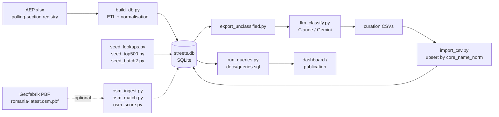
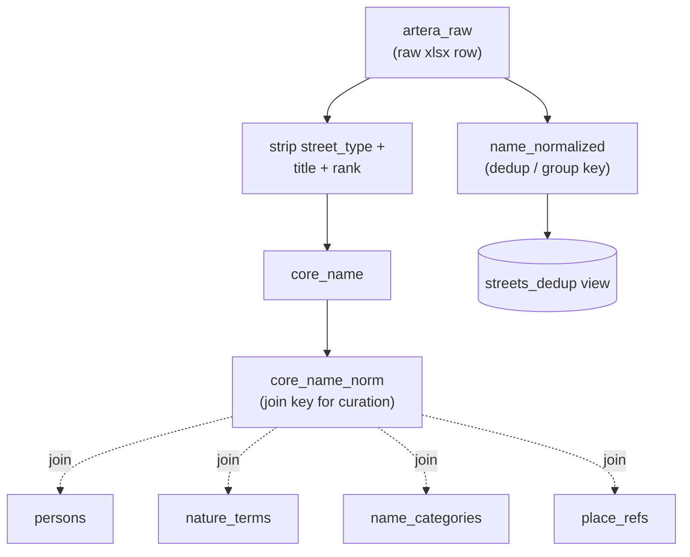
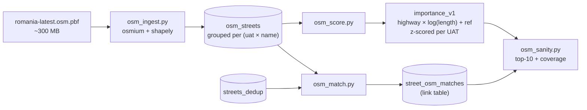
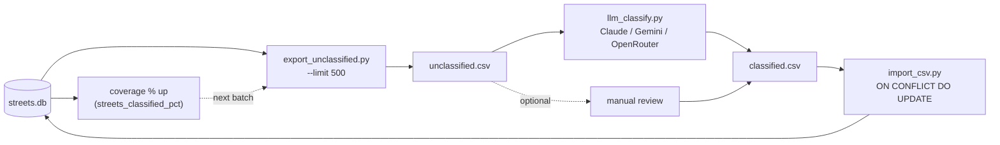

# Statistici Nume Străzi România

[strazi.gov2.ro](https://strazi.gov2.ro/)

Analysis of Romanian street names from the Permanent Electoral Authority's
polling-section registry (~141,000 rows, 41 județe + Bucharest sectors).

The output is a SQLite database with a query catalog, eventually feeding a
Romanian-language interactive publication.

---

## What it does

- Ingests the registry xlsx into a normalised SQLite schema
- Deduplicates streets that span multiple polling sections
- Extracts street type, rank prefix, core name, and saint/numeric/date flags
- Classifies street names against four curated lookup tables:
  **persons**, **nature_terms**, **name_categories**, **place_refs**
- Enriches streets with OSM geometry, road class, and an importance score
  derived from highway hierarchy and length (per-UAT z-scored)
- Provides a named SQL query catalog covering overview, people, themes,
  regional maps, renaming history, curiosities, and OSM coverage gaps

Current coverage: **~57% classified** (105,107 deduped streets across 1,155 UATs).

---

## Pipeline

End-to-end flow from raw registry to query catalog. OSM enrichment is an
optional parallel branch.



### Normalisation and join keys

`build_db.py` extracts two distinct normalisation keys from each raw street.
Mixing them is the most common source of wrong results.



Never count on `streets` directly — section-rows duplicate streets that span
multiple polling sections. Always use the `streets_dedup` view.

---

## Requirements

Python 3.11+. Core dependencies:

```bash
# ETL + LLM classifier
pip install openpyxl anthropic

# OSM enrichment (optional — only needed to run tools/osm_ingest.py)
pip install osmium shapely
```

A virtual environment is recommended:

```bash
python3 -m venv .venv && source .venv/bin/activate
pip install openpyxl anthropic
```

---

## Data source

The source file is the Romanian Electoral Authority's polling-section registry
("Registrul Secțiilor de Vot"). Download the latest xlsx from
[roaep.ro](https://www.roaep.ro) and place it in `data/reference/`.

The file is not committed to this repo (large xlsx, ~10 MB).

---

## Setup and build

```bash
# 1. Build the database from the xlsx
python3 build_db.py

# 2. Apply hand-curated starter seed
python3 seed_lookups.py

# 3. Apply pre-classified batches (ships with the repo)
python3 tools/seed_top500.py
python3 tools/seed_batch2.py

# 4. Run the full query catalog
python3 run_queries.py
```

For fast iteration during development, limit the number of rows ingested:

```bash
python3 build_db.py --limit 5000
```

---

## OSM enrichment

Streets can be enriched with OpenStreetMap geometry, road class, and an
importance score. This step is optional — the core registry analysis works
without it.



Motorways and trunks are filtered at ingest — OSM scope is populated areas only.
Registry ↔ OSM is a link table, not a merge: a registry street can have 0, 1,
or many OSM matches.

```bash
# Requires: pip install osmium shapely
# Requires: Romania PBF from Geofabrik (~300 MB) at data/reference/romania-latest.osm.pbf

# 1. Ingest OSM ways into osm_streets (~15 min on full Romania PBF)
python3 tools/osm_ingest.py

# 2. Join registry streets to OSM streets (pure SQL, fast)
python3 tools/osm_match.py

# 3. Compute importance_v1 score per OSM street
python3 tools/osm_score.py

# 4. Eyeball top-10 rankings and registry coverage for reference UATs
python3 tools/osm_sanity.py
```

The importance score is `highway_weight × log(1 + length_m) + ref_bonus`,
z-scored within each UAT so cities and villages are comparable.

Download the PBF:

```bash
wget https://download.geofabrik.de/europe/romania-latest.osm.pbf \
     -O data/reference/romania-latest.osm.pbf
```

---

## Curation workflow

Classification is stored in four lookup tables keyed on `core_name_norm`.
The workflow is: export unclassified keys → classify → import. The loop is
idempotent — re-importing the same CSV is a no-op.




```bash
# Export top-500 unclassified keys to a CSV for manual review
python3 tools/export_unclassified.py --limit 500

# Classify with Claude Haiku (requires ANTHROPIC_API_KEY — see below)
python3 tools/llm_classify.py --limit 500 --out data/curation/llm_batch1.csv

# Review the output CSV, then import
python3 tools/import_csv.py data/curation/llm_batch1.csv

# Or classify and import in one step
python3 tools/llm_classify.py --limit 500 --out data/curation/llm_batch1.csv --import
```

`llm_classify.py` is resumable: re-running with the same `--out` file skips
keys already written to it.

### API key

The LLM classifier uses the [Anthropic API](https://console.anthropic.com).
The key is read from the environment — it is never stored in the repo.

```bash
export ANTHROPIC_API_KEY=sk-ant-...
```

To persist across sessions, add it to your shell profile (`~/.zshrc` or `~/.bashrc`):

```bash
echo 'export ANTHROPIC_API_KEY=sk-ant-...' >> ~/.zshrc
```

---

## Repository layout

```
.
├── build_db.py           # ETL: xlsx → SQLite (idempotent)
├── seed_lookups.py       # Hand-curated starter seed for lookup tables
├── run_queries.py        # Runs all named queries from docs/queries.sql
├── streets_lib.py        # Shared normalisation helpers
├── docs/
│   ├── CODE_SPEC.md      # Full data-layer PRD
│   ├── DESIGN_BRIEF.md   # Editorial direction for the publication
│   ├── queries.sql       # Named SQL query catalog (-- :name slug)
│   ├── BACKLOG.md        # Tracked issues and future work
│   └── activity-history.md
├── tools/
│   ├── export_unclassified.py  # Export top-N unclassified keys to CSV
│   ├── import_csv.py           # Upsert classified CSV into lookup tables
│   ├── llm_classify.py         # Claude Haiku batch classifier
│   ├── seed_top500.py          # Batch 1 curation (top-500 keys)
│   ├── seed_batch2.py          # Batch 2 curation
│   ├── osm_ingest.py           # PBF → osm_streets (osmium + shapely)
│   ├── osm_match.py            # streets_dedup ↔ osm_streets join (pure SQL)
│   ├── osm_score.py            # importance_v1 score + per-UAT z-score
│   └── osm_sanity.py           # Top-10 rankings + registry coverage report
└── data/
    ├── reference/        # Source xlsx + OSM PBF (not committed — download separately)
    ├── curation/         # Curated classification CSVs (committed)
    ├── gis/              # UAT centroid coordinates + TopoJSON for choropleth maps
    └── streets.db        # Generated artifact (not committed)
```

---

## Coverage

| status | streets | % |
|---|---|---|
| unclassified | 45,286 | 43.1% |
| nature | 27,356 | 26.0% |
| person | 11,297 | 10.7% |
| place | 4,343 | 4.1% |
| abstract | 3,483 | 3.3% |
| institutional | 3,197 | 3.0% |
| ideological | 2,806 | 2.7% |
| trade | 2,099 | 2.0% |
| occupational | 1,048 | 1.0% |
| religious (saint) | 1,035 | 1.0% |
| numeric | 860 | 0.8% |
| date | 775 | 0.7% |
| commemorative | 731 | 0.7% |
| infrastructure | 441 | 0.4% |
| mythology | 350 | 0.3% |

105,107 deduped streets · 1,155 UATs · 42 județe (41 + Bucharest as 6 sectors)

### OSM match coverage

**Overall:** 52.2% of registry streets matched to OSM; 53.4% of OSM streets matched to registry.
105,104 registry streets, 105,905 OSM streets ≈ same scale, different compositions.

**Per-reference-UAT:**
- Cluj-Napoca (city): 75%
- Sibiu (city): 77%
- Câmpulung Moldovenesc (town, SV): 64%
- Cornu (rural, PH): 65%
- Bucharest Sector 1: ~31% (centroid imprecision for interleaved sectors)

**The 48% unmatched registry gap:**
Three categories of unmatched registry streets:
1. **Naming convention mismatches** — OSM omits street-type prefixes ("Mihai Eminescu" vs
   "Strada Mihai Eminescu") or uses abbreviations differently. We've fixed the "G-ral" →
   "General" expansion; others remain (e.g., `prof.dr.` prefix cases).
2. **Electoral-only paths** — Rural UATs with small populations may have polling sections
   on unnumbered or unofficial paths that OSM has never tagged.
3. **Rural/sparse coverage** — OSM mapping in Romania concentrates in cities. Smaller villages
   and hamlets have sparser street-level tagging.

**The 47% unmatched OSM gap:**
Mostly real streets with no registered voters:
- Scenic/transit roads (Transalpina, Transfăgărășan)
- New residential developments post-2021 (OSM updated, registry hasn't)
- Industrial/private access roads, park paths
- Roads in very low-density areas

**Why not merge the datasets?**
The registry and OSM serve different purposes: electoral authority (ground truth for voters) vs
community mapping (geometry + road hierarchy). Forcing a 1:1 merge would either:
- Drop ~47k useful registry streets for which no OSM exists
- Invent fake OSM entries from electoral data (unreliable for road classification)
- Create conflicting canonical names

Instead, use `street_osm_matches` as a **link table**: registry streets can have 0, 1, or many
OSM matches (rare). Query it to combine signals (e.g. electoral presence × road importance).

**Key finding:** OSM coverage is regionally stratified. Gorj (17.7%), Dâmbovita (27.5%), Sibiu (30.8%)
have low matches; Tulcea (87.3%), Brăila (81%), Mehedinți (75%) have high matches. The unmatched
Gorj streets (mostly generic nature names like "Principală", "Bisericii", "Viilor") don't exist in
OSM at all — this is sparse mapping of rural villages, not a naming-mismatch issue. Similar stratification
likely holds for other datasets that depend on community volunteers (Wikipedia, Wikidata).

**To investigate further:**
```sql
-- Frequent registry streets with zero OSM matches
-- (query: registry_osm_gap)
SELECT name, COUNT(DISTINCT uat) AS uats
FROM streets_dedup
WHERE NOT EXISTS (SELECT 1 FROM street_osm_matches m WHERE m.street_id = streets_dedup.id)
GROUP BY name_normalized HAVING COUNT(*) > 10
ORDER BY uats DESC;

-- Per-judet breakdown (high variance: Gorj 17.7%, Tulcea 87.3%)
-- (query: osm_judet_coverage)
SELECT judet, COUNT(*) AS registry_streets,
       SUM(CASE WHEN osm_matched THEN 1 ELSE 0 END) AS matched
FROM streets_dedup ...
```
